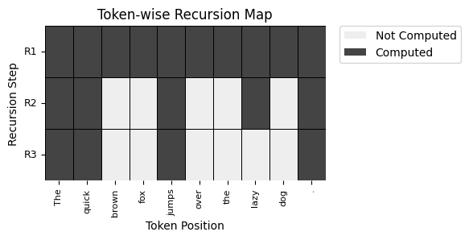

# Mixture of Recursion (MoR) Implementation

In the file, We've tried to implement [this](https://arxiv.org/abs/2507.10524) paper. In this paper, they have introduced the concept of Mixture of Recursion (MoR) to improve the recursive transformer by dynamically assigning recursive depths to indivisual tokens.

## Models used

In the notebook, we have build a simple MoR model that uses a standard transformer block, a routing head and an MoRModel that combines the above with a final output layer. The model is trained on the Wikitext-2 dataset.

## Methods used

The paper introduces:
- **Mixture of Recursion (MoR)**: A method to dynamically assign recursive depths to tokens, allowing for more efficient processing of sequences.
- **Routing Head**: A mechanism to determine the depth of recursion for each token based on its context.

## Results

Here, we can see the recursion depth calculated for each token in the sequence. The model dynamically assigns depths based on the context of the tokens, allowing for more efficient processing.

## References
- Paper: [arXiv:2507.10524 [cs.CL]](https://arxiv.org/abs/2507.10524)

## Contributing
If you'd like to contribute to the code, please refer to `contribute.md` in the root folder

## To be done
- [ ] Purpose of kv_cache is not clear, need to implement it properly
- [ ] Implement Expert-choice Routing
- [ ] Benchmark the model against a standard transformer model